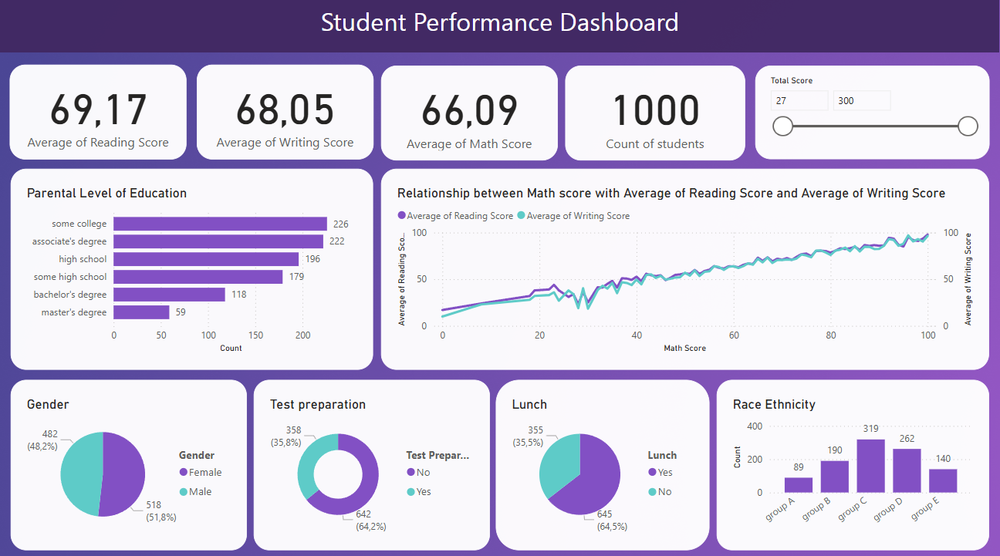

  

## 📄 Project Description

This project showcases a Student Performance Dashboard created using Microsoft Power BI. The dashboard provides a comprehensive analysis of student performance based on various metrics such as scores in reading, writing, and math, as well as demographic and background information. The goal is to present the data in an insightful, interactive, and visually appealing manner to support decision-making and educational analysis.

## 🚀 Key Features

1. Performance Metrics:

- Average Reading Score: 69.17
- Average Writing Score: 68.05
- Average Math Score: 66.09
- Total Students: 1000

2. Interactive Filters: A slider to filter total scores dynamically.

3. Visual Insights:

- Parental level of education breakdown.
- Correlation between math scores and average reading/writing scores.
- Gender distribution (male vs. female).
- Test preparation completion rates.
- Lunch program participation statistics.
- Race/ethnicity distribution grouped by categories.

## 🔑 Key Insights

1. **Parental Education:** Students with parents holding a Master's degree have the highest average scores in reading, writing, and math, followed by those with a Bachelor's and Associate's degree.

2.  **Gender Performance:** Female students perform better in reading and writing, while male students score higher in math.

3. **Test Preparation:** Students who completed test preparation scored higher in all subjects compared to those who did not.

4. **Lunch Program:** Students who had lunch scored above 70 on average in all subjects, outperforming those who skipped lunch.

5. **Race/Ethnicity:** Group E has the highest representation and scores compared to other groups.

6. **Math Score Correlation:** Math scores tend to influence reading and writing scores. Students with high math scores also have high reading and writing scores, and the same is true in reverse.

## 🛠 Tools and Technologies

1. **Microsoft Power BI:** To create the interactive and visually rich dashboard.

2. **Data Source:** Dataset containing student demographic and performance metrics. Data used from Kaggle.

## 🎯 Outcomes

1. **Enhanced Data Understanding:** Gain insights into how demographic factors influence academic performance.

2. **Actionable Insights:** Identify areas where interventions, such as additional resources or programs, might be required (e.g., low-performing groups or lunch program impact).

3. **Scalability:** This dashboard can be adapted to analyze performance data from other schools or districts with minimal adjustments.

## 📊 Data Highlights

1. **Parental Level of Education:** Most students come from families where parents have attended "some college" or have an "associate's degree."

2. **Lunch Program:** A significant portion of students participate in lunch programs, indicating socioeconomic diversity.

3. **Test Preparation:** Students who completed test preparation tend to have better scores, providing an actionable takeaway for improvement programs.

4. **Gender Equality:** Balanced gender representation with slightly more female students.

